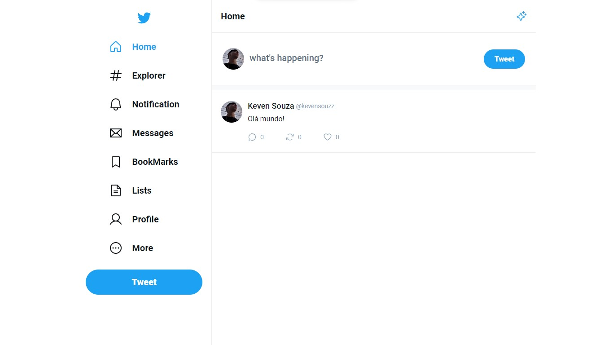

## UI-TWITTER | ReactJS

Interface de usuário do twitter desenvolvida com ReactJs e TypeScript.

## Ferramentas 📌

HTML | SASS | TypeScript | ReactJS

### Para rodar na sua máquina

> É necessário o NodeJS instalando...

**PASSO 1 - clonar o repositório**

> No github, vá até o botão `<> CODE`
> E escolha uma das opções pra clonar o repositório para sua máquina

**PASSO 2 - instalar as dependencias do Node**

> Com o repositório na sua máquina
> insira no terminal: `npm install` para instalar as dependências do Node
> Com as dependências instaladas, insira no terminal `npm run dev` e clique na URL que foi retornada